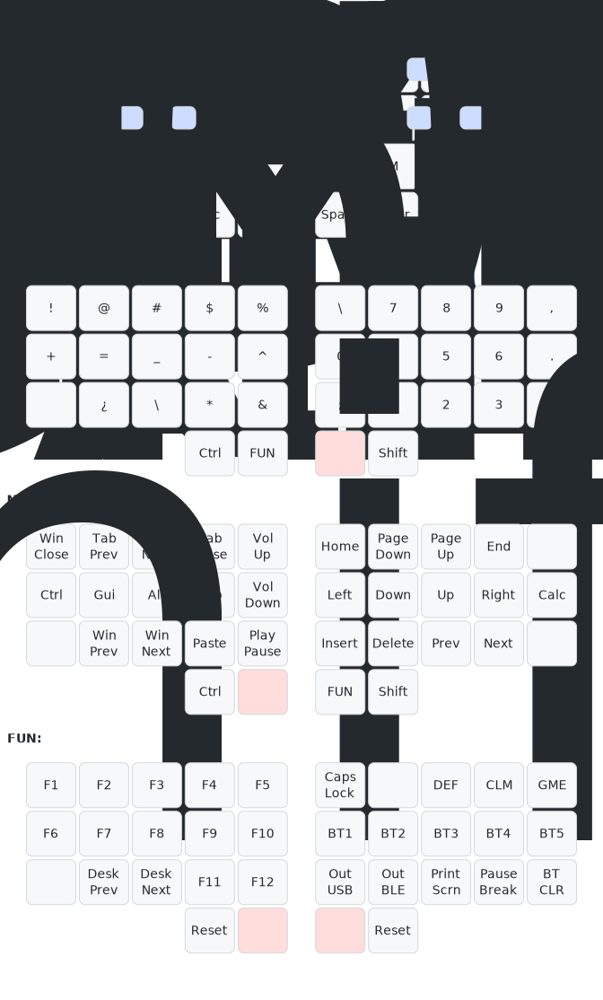

# Keymap Visualizer

This is a visualizer for keymaps, similar to [`keymap`](https://github.com/callum-oakley/keymap) that it is forked from.

## Differences from original
- Supports custom-sized layouts
    - Non-split layout support in the future
- Reads physical layout and keymap definitions from yaml files
- Supports hold-tap keys
- Supports combos
    - Only two non-thumb neighboring positions, for now
    - Uses ZMK-like position indices (starting from 0, increasing row-by-row
- Layer labels
- Slightly different styling

For expected input schema, please see examples in [keymaps](keymaps/) folder.

## Example layout
Below is an example layout generated with `python draw.py keymaps/3x5+2.formal.yaml >keymap.svg`:

